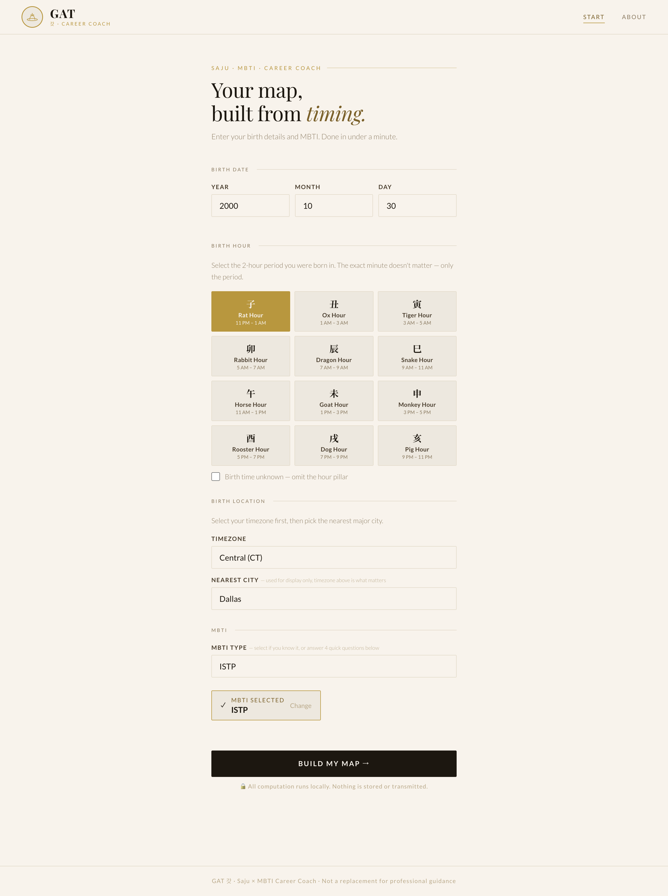

# 🦁 GAT (갓)

> **Korean Four Pillars (Saju) × MBTI Career Coach**  
> A futuristic, privacy-first web app that generates a personalized **career & study profile** from **Mansaeryeok (Four Pillars)** + MBTI preferences — **100% in your browser**.



---

## What Is This?

GAT combines the **astronomical timing logic** of Korean Four Pillars astrology (사주, Saju / BaZi) with MBTI preferences to produce a **work-style archetype profile** you can use for:

- major / study direction
- career exploration
- work environment fit
- stress & burnout pattern awareness

**No accounts. No backend. No analytics.**  
Everything runs locally — your birth data never leaves your device.

---

## Quick Start

### Run Locally

```bash
npm install
npm run dev
```

---

## Publish for Free (GitHub Pages)

1. Create a **Public** GitHub repo
2. In `vite.config.js`, set `base` to your repo name:

```js
base: '/your-repo-name/',
```

3. Push your code:

```bash
git init
git add .
git commit -m "init"
git branch -M main
git remote add origin https://github.com/YOUR_USERNAME/YOUR_REPO.git
git push -u origin main
```

4. Enable GitHub Pages:
   - Repo → **Settings → Pages → Source: GitHub Actions**

✅ Live at: `https://YOUR_USERNAME.github.io/YOUR_REPO/`

---

## What It Does

1) **Calculates your Four Pillars (사주팔자 / 만세력)** from birth date, time, and city  
2) **Collects MBTI** (or a quick 4-axis mini check if you don’t know it)  
3) **Combines both signals** to estimate your primary & secondary work-style archetype  
4) Shows a clean breakdown of **why** you got that result

**Current weighting:**
- MBTI axes → **60%**
- Day Master element → **40%**

---

## The Archetypes

| Archetype | Core trait | Best-fit areas |
|---|---|---|
| **Builder** | Systems thinking, structure | Engineering, ops, product, architecture |
| **Analyst** | Depth over speed, root cause | Research, finance, consulting, law |
| **Connector** | Social processing, teaching | Marketing, leadership, community, sales |
| **Creator** | Aesthetic judgment, originality | Design, writing, brand, UX, media |

---

## File Structure

```text
gat/
├── src/
│   ├── App.jsx
│   └── main.jsx
├── index.html
├── vite.config.js
├── LICENSE
├── README.md
└── package.json
```

---

## Privacy

- All computation happens **in the browser**.
- No birth data, MBTI input, or results are sent to any server.
- No database. No backend. No analytics.
- Closing the tab erases everything.

---

## About the Four Pillars (Mansaeryeok) Calculation

GAT uses a **solar-term-based** approach (절기 기반):

- **Year pillar changes at Lichun (입춘)** — not Lunar New Year
- Solar term timestamps (2000–2026) are stored as **UTC**
- Timezone conversion uses `Intl.DateTimeFormat` binary search for **historical DST accuracy**
- Supports **60+ cities** worldwide with automatic timezone assignment

> Note: This project focuses on computational correctness and a clean local-only privacy model.  
> It’s designed for career/study reflection — not a replacement for professional guidance.

---

## FAQ

### Do you store my birth data?
No. By design, everything runs locally in your browser. Nothing is transmitted.

### What if I don’t know my birth time?
For now, birth time is recommended. A “birth time unknown” mode (hour pillar omitted) is on the roadmap.

### Is this “fortune telling”?
GAT is built as a **career & study reflection tool**. It does not provide medical/legal/financial advice.

---

## Roadmap (Ideas)

- [ ] Add “birth time unknown” mode (hour pillar omitted)
- [ ] Expand archetype system (more nuanced combinations)
- [ ] Improve city search + add more locations
- [ ] Add a shareable report view (still privacy-first)
- [ ] Add optional “Saja Voice” micro-coach tips (subtle, not gimmicky)

---

## Contributing

Ways to help:
- Open an Issue (bug reports, edge cases, feature suggestions)
- Submit a PR (especially for city/timezone coverage or test cases)
- Suggest better archetype mapping logic (with clear justification)

---

## License

MIT — free to use, modify, and distribute.

---

*Built by **Lareine Han** · LinkedIn: https://www.linkedin.com/in/lareinehan/*
